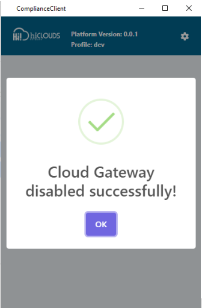

# Compliance client

- 
    - [What is a compliance client?](#what-is-a-compliance-client)
    - [Why do we need a compliance client?](#why-do-we-need-a-compliance-client)
    - [How to use a compliance client](#how-to-use-a-compliance-client)
        - [How to install compliance client app in windows](#how-to-install-compliance-client-app-in-windows)
            - [Download the compliance client app](#download-the-compliance-client-app)
            - [Verify system requirements](#verify-system-requirements)
            - [Run the installation file](#run-the-installation-file)
        - [Application Tour](#application-tour)
            - [Main window](#main-window)
        - [How to configure](#how-to-configure)
        - [Compliance Client profile](#compliance-client-profile)
            - [What is a profile](#what-is-a-profile)
            - [Why do we need a profile](#why-do-we-need-a-profile)
            - [How to configure the profile](#how-to-configure-the-profile)
        - [How to create a profile](#how-to-create-a-profile)
        - [How to edit a profile](#how-to-edit-a-profile)
        - [How to remove a profile](#how-to-remove-a-profile)
        - [How to use a profile](#how-to-use-a-profile)
        - [How to go back to the main windows](#how-to-go-back-to-the-main-windows)
    - [Use a compliance client](#use-a-compliance-client)
    - [Conclusion](#conclusion)

<!-- /TOC -->

## What is a compliance client?
The Compliance Client is a software application that helps professionals and organizations comply with legal regulations and industry standards. It is used to enhance compliance practices, track, generate reports, and automate compliance tasks. The Compliance Client application comes into play in situations where adherence to regulatory standards or compliance protocols is not being maintained, providing a comprehensive solution for addressing and rectifying non-compliance issues.

## Why do we need a compliance client?
The compliance client gives control to the compliance vendor. if they doing an illegal activity, those people detect it, and disable it, a compliance client is required for this. When someone accesses the internet without knowing it on the cloud gateway, for example, financial fraud, network damage, all these things are not known if they happen directly to the cloud gateway, then we can detect it by entering the device ID is disabled here and can easily disable it. A compliance client is required for this. Using a compliance client helps your organization stay up-to-date with regulations and ensure your data is secure. The exact steps involved in using the Compliance Client will vary depending on the specific product you are using.

## How to use a compliance client
A compliance client is used to disable CE devices. Using a compliance client helps your organization stay up-to-date with regulations and ensure your data is secure. The exact steps involved in using the Compliance Client will vary depending on the specific product you are using. The steps to use it are as follows.

### How to install compliance client app in windows
Installing a compliance client application typically involves downloading the software from the vendor's website and following the installation instructions. The exact steps may vary depending on the application and your operating system, However, the general process is as follows.

#### Download the compliance client app
Start by visiting the compliance client vendor's website. Visit the download page for the application. Select the appropriate version for your operating system. Usually you Windows. There will be download options for Macs and Linux.

#### Verify system requirements
Before proceeding with the installation, ensure that your system meets the minimum requirements specified by the vendor. It usually includes details about operating system versions, processors, RAM, and available storage space.

#### Run the installation file
1. Once the download is complete, locate the installation file (usually a .exe or .pkg file) right-click it to start the installation process, and install the file by clicking Run as Administration.

2. When the file is installed you will see something like the image below.
   

3. Click on “Yes” as shown in the red box.
   
### Application Tour
#### Main window
1. When you first install the app, you will see something like the following image.
   
     

2. There you will first see the name of the Compliance Client app in the header.
3. There it will show you the platform version name and profile name.
4. There you will see the Rights Side setting.
   

5. The first time you are installing, it will be written that the setting before using the application will be written. You have to go to the settings and set the profile.
     

6. You will then be shown the name Device below. There you have to write in the  Device Id.
7. Then you have to write the reason for disabling your device where you will be shown the reason.
8. Then you will see a button for “OK” and “Cancel” at the.
9.  To do this thing first you have to set.
      

### How to configure
- To configure the profile you have to go to settings.
- To configure the compliance client application you will first need to provide a token and rural. And for that, you need to have one profile. And if you have If you don't have an API Token and URL then contact hiCLOUDS NOC/support.
  
### Compliance Client profile
1. As seen in the image, the compliance client's profile.
  

2. To reach the compliance client profile you have to click on the settings shown in the main windows.
   

#### What is a profile
- A profile is an object containing a set of requirements where specific pages define compliance requirements and Contain controls, outputs, and configurations. It acts as a blueprint for evaluating the organization towards its policies.
- Here the profile includes Name, API Token, Language, and URL. 
- Profiles can be tailored for cyber security and to address specific moments.
  
  

#### Why do we need a profile
  - To do any work, its profile is needed. Profiles are essential for effective compliance management because they provide a structured framework for evaluating an organization's compliance posture. By defining the specific requirements that need to be met, profiles help organizations identify potential risks, prioritize remediation efforts, and demonstrate compliance to auditors and stakeholders! 
   

#### How to configure the profile
1. To configure the profile, first go to the settings shown in Windows.
2. When you go to settings you will see something like the image shown below.
   

3. As seen in the image you have to fill up which is as follows.
  
- **Select profile**: You have to write the name of your profile in the select profile.
- **API Token**:  Given token should be written here if you don't have a token then as explained in **[How to configure](#how-to-configure)**  you have to import the received token and write it here.
- **Select Default Language**: Here As stated by the seller, you have to select the language. **Ex- English**
- **URL**: Here you will have to write the rural of the main profile which you have to contact the cloud support team which will provide the rural.
  
4. After that click on the **“save”** button.

### How to create a profile
1. To activate a profile you have to select a new profile by going to select profile as shown in the image.
2. Then you have to write the profile name. Then the profile has to be done as explained in **"[How to configure the profile](#how-to-configure-the-profile)”**.
   

### How to edit a profile
1. How to open from the main windows to edit a profile is described in **"[Compliance Client profile](#compliance-client-profile)"**.
2. You can edit your profile from there as shown in the image. From there you can also select New Profile and edit the existing name.
   

### How to remove a profile
  - If you want to remove your profile after you fill up all your details here as shown in the image As shown in the red box You can delete the profile by clicking on its **“remove”** button.
  

### How to use a profile
1. If you want to use your profile, complete your details as described in **"[How to configure](#how-to-configure)"**. You can click on the **“save”** button in your profile And you can use your profile.
   

2. After clicking on the save button, something like the see image will open in which you have to click **“OK”**.
   

### How to go back to the main windows
1. If you want to go across your main window from profile settings Then click on the arrow on the right side of your profile.
2. Clicking on the arrow will directly take you to your main window.
     

 ## Use a compliance client
 1. After setting the profile and saving it, you will directly reach the main window as shown in the image.
   

2. Then you have to fill it up as written below.
- **CE Device ID**: You have to contact the support team of Hiclouds to get the CE device ID. Then write here.
- **Reason**: The reason you want to disable it should be written here. **Ex: Malicious activities are detected**.
  
 3. After that click **“OK”**.
 4. After that, it will be written that the process has been disabled.
      

## Conclusion

In a system where the compliance vendor is in charge, the integration of a compliance client is necessary to preserve security and regulatory compliance. Through activity monitoring at the cloud gateway, this client helps detect illicit actions, like financial fraud and network damage. The compliance client gives the vendor the authority to quickly disable the linked device in the case of any illegal access or suspicious activity, guaranteeing the execution of compliance policies and reducing possible systemic risks. This proactive approach to security emphasizes how important a compliance client is to protect the network infrastructure from unanticipated attacks and unwanted activity.

   